# 1) Графики обучения для нейронной сети EfficientNet-B0 с использованием Transfer Learning и различных фиксированных темпах обучения 0.01, 0.001, 0.0001
 Изменения фиксированных темпов обучения.
```
    optimizer=tf.optimizers.Adam(lr=0.01)
```
```
    optimizer=tf.optimizers.Adam(lr=0.001)
```
```
    optimizer=tf.optimizers.Adam(lr=0.0001)
```
  - Легенда:

   
  
   График метрики качества:
   

  - Легенда:

   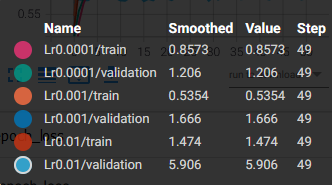

  График функции потерь:
   

# 2) Графики обучения для нейронной сети EfficientNet-B0 с использованием политики изменения темпа обучения - косинусное затухание.
 Изменения начальных темпов обучения для косинусного затухания.
```
    LearningRateScheduler(tf.keras.experimental.CosineDecay(0.01, 1000, 0.0))
```
```
    LearningRateScheduler(tf.keras.experimental.CosineDecay(0.001, 1000, 0.0))
```
```
    LearningRateScheduler(tf.keras.experimental.CosineDecay(0.0001, 1000, 0.0))
```
  - Легенда:

   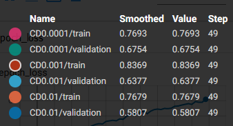
  
   График метрики качества:
   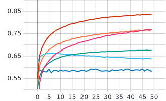
   
   - Легенда:

   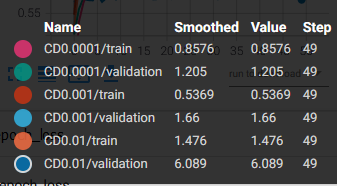

  График функции потерь:
   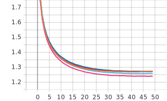

# 3) Графики обучения для нейронной сети EfficientNet-B0 с использованием политики изменения темпа обучения - косинусное затухание с перезапусками.
 Изменения начальных темпов обучения для косинусного затухания с перезапусками.
```
    LearningRateScheduler(tf.keras.experimental.CosineDecayRestarts(0.001, 1000, 2.0, 1.0, 0.0, None))
```
```
    LearningRateScheduler(tf.keras.experimental.CosineDecayRestarts(0.0001, 1000, 2.0, 1.0, 0.0, None))
```
```
    LearningRateScheduler(tf.keras.experimental.CosineDecayRestarts(0.0002, 1000, 2.0, 1.0, 0.0, None))
```
  - Легенда:

   
  
   График метрики качества:
   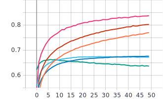
   
   - Легенда:

   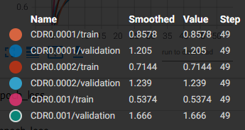

  График функции потерь:
   
   
   # 4) Графики обучения наилучших темпов обучения для фиксированных темпов обучения, косинусного затухания и косинусного затухания с перезапусками.
  - Легенда:

   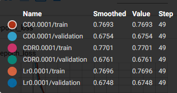
  
   График метрики качества:
   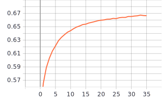
   
   - Легенда:

   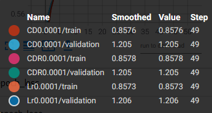

  График функции потерь:
   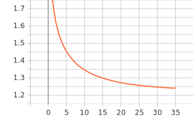
   
# 5) Анализ полученных результатов

   Для каждого из методов выбора темпа обучения можно выбрать оптимальные параметры, а именно для фиксированного темпа обучения максимальная точность на валидации 67,48% при темпе обучения 0.0001. В случае с косинусным затуханием стал метод с начальным темпом обучения 0.0001 на котором точность на валидации составила 67,54%, а для косинусного затухания с перезапусками 67,61% так же при начальном темпе обучения 0.0001. Можно сделать вывод, что оптимальным значением темпа обучения яв-ся 0.0001 т.к на нем были достигнуты максимальная точность и минимальная ошибка на валидации. По сравнению методов, все методы при оптимальном значении темпа обучения показали практически одинаковый результат.
