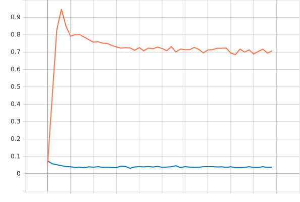
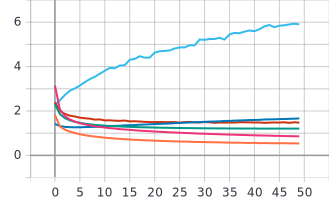
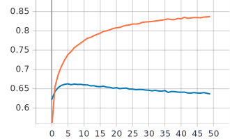
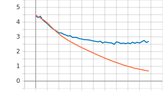

# 1) Описание архитектуры нейронной сети:

   1) Создание тензора данных.
```
inputs = tf.keras.Input(shape=(RESIZE_TO, RESIZE_TO, 3))
```
   2) Свёрточный слой с 8-ю фильтрами и ядром свёртки размером 3x3.
```
x = tf.keras.layers.Conv2D(filters=8, kernel_size=3)(inputs)
```
   3) Уменьшение размера матрицы признаков выбором максимального значения.
```
x = tf.keras.layers.MaxPool2D()(x)
```
   4) Перевод многоменроного тензора в одномерный вектор.
```
x = tf.keras.layers.Flatten()(x)
```
   5) Полносвязный слой с 101-м выходом и функцией активации softmax, которая приводит результат к вероятностному виду.
```
outputs = tf.keras.layers.Dense(NUM_CLASSES, activation=tf.keras.activations.softmax)(x)
```

# 2) Графики обучения для предоставленной реализации нейронной сети.
 
  - Синий - валидация
  - Оранженвый - обучение
  
   График метрики качества:
   

  График функции потерь:
   

# 3) Графики обучения для произвольной архитектуры с количеством сверточных слоев >3.
  1) Описание архитектуры нейронной сети.
      Нейронная сеть с 4-мя сверточными слоями с 8-ю фильтрами и 3 слоями макспулинга.
```
    inputs = tf.keras.Input(shape=(RESIZE_TO, RESIZE_TO, 3))
    x = tf.keras.layers.Conv2D(filters=8, kernel_size=3)(inputs)
    x = tf.keras.layers.MaxPool2D()(x)
    x = tf.keras.layers.Conv2D(filters=8, kernel_size=3)(x)
    x = tf.keras.layers.MaxPool2D()(x)
    x = tf.keras.layers.Conv2D(filters=8, kernel_size=3)(x)
    x = tf.keras.layers.MaxPool2D()(x)
    x = tf.keras.layers.Conv2D(filters=8, kernel_size=3)(x)
    x = tf.keras.layers.Flatten()(x)
    outputs = tf.keras.layers.Dense(NUM_CLASSES, activation=tf.keras.activations.softmax)(x)
```
   2) Графики обучения.

  - Синий - валидация
  - Оранженвый - обучение
  
   Визуализация выбранной метрики качества:
   

   Визуализация выбранной функции потерь:
   


# 4) Анализ полученных результатов

   По полученным результатам и графикам можем сделать выводы: Сравнив графики метрики качества и функции потерь можно заметить, что добавление 3-х свёрточных слоев и 2-х слоев макспулинга не привело к улучшению обучения, а также увеличение глубины нейронной сети привело к увеличению времени обучения. Это связано с тем, что первая нейронная сеть состоит из всего 1 слоя, а вторая была произвольной архитектуры выбранной наугад.
