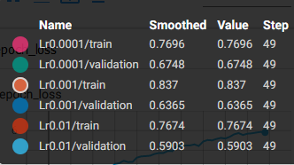
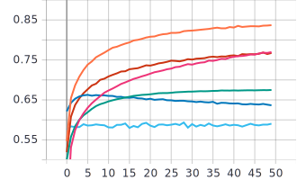
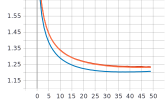

# 1) Графики обучения для нейронной сети EfficientNet-B0 с использованием Transfer Learning и различных фиксированных темпах обучения 0.01, 0.001, 0.0001
 Изменения фиксированных темпов обучения.
```
    optimizer=tf.optimizers.Adam(lr=0.01)
```
```
    optimizer=tf.optimizers.Adam(lr=0.001)
```
```
    optimizer=tf.optimizers.Adam(lr=0.0001)
```
  - Легенда:
   
  
   График метрики качества:
   

  График функции потерь:
   

# 2) Графики обучения для нейронной сети EfficientNet-B0 (предобученная на базе изображений imagenet) с использованием техники обучения Transfer Learning.
  
  - Синий - валидация
  - Оранжевый - обучение
  
   График метрики качества:
   

   График функции потерь:
   


# 3) Анализ полученных результатов

   Сравнив графики обучения для нейронной сети EfficientNet-B0 со случайным начальным приближением и графики обучения для нейронной сети EfficientNet-B0 (предобученная на базе изображений imagenet) с использованием техники обучения Transfer Learning. Видно, что используя технику обучения Transfer Learning был получен результат с большей точностью чем со случайным начальным приближение, около 83% на обучении и 63% на валидации в то время как со случайным начальным приближением максимальная точность была 34% на обучении и 28% на валидации, а так же это привело к уменьшению времени обучения из-за использования предобученной сети, что сократило время обучения с ≈6 часов до полутора часа.
