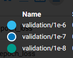

# 1) Графики обучения для нейронной сети EfficientNet-B0 с использованием Transfer Learning, техники аугментации данных и политики темпа обучения с оптимальными параметрами.

  - Легенда:

  - Синий - валидация
  - Оранженвый - обучение
  
   График метрики качества:
   .svg)

  - Легенда:

  - Синий - валидация
  - Оранженвый - обучение

  График функции потерь:
   .svg)

# 2) Графики обучения для нейронной сети EfficientNet-B0 с использованием техники обучения FineTuning c разлиными темпами обучения. 
   
   Для данного подхода были выбраны темпы обучения: 1е-6, 1е-7, 1е-8.
   
  - Легенда:

   
  
   График метрики качества (на валидации):
   .svg)
   
   - Легенда:

  

  График функции потерь (на валидации):
   .svg)
   
   
# 3) Анализ полученных результатов

   Максимальная точность при использовании FineTuning на валидации достигает 68.58% на 1 эпохе при темпе обучения 1e-6, что на 1.04% больше чем при испольовании Transfer Learning без FineTuning, однако затем точность резко ухудшается ( на 10 эпохе составляет  45.24% ).
