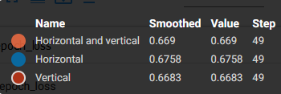
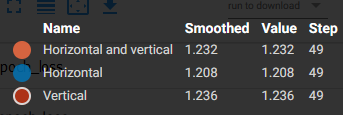
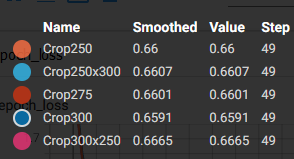
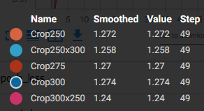
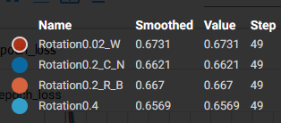
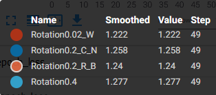
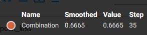
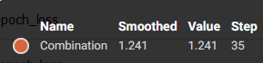

# 1) Графики обучения для нейронной сети EfficientNet-B0 с использованием Transfer Learning и техники аугментации данных "Случайное горизонтальное и вертикальное отображение"

 mode - тип отображения.
```
tf.keras.layers.experimental.preprocessing.RandomFlip(mode=HORIZONTAL_AND_VERTICAL)
```

  - Легенда:

   
  
   График метрики качества (на валидации):
   

  - Легенда:

   

  График функции потерь (на валидации):
   

Наилучшим параметром отображения оказалось горизонтальное отображение. При нем значения метрики точности достигло 67,58%. На графике функции потерь горизонтального отображения наблюдается наименьшее значение 1,208. 

Результат применения техники аугментации данных "Горизонтальное отображение":


# 2) Графики обучения для нейронной сети EfficientNet-B0 с использованием Transfer Learning и техники аугментации данных "Использование случайной части изображения" 
  
  height - высота выходной формы.
  
  width - ширина выходной формы.
```
tf.keras.layers.experimental.preprocessing.RandomCrop(height, width)
```
 
 Начальными размерами изображения были выбраны: 250x250, 275x275, 300x300, 250x300, 300x250.
 
  - Легенда:

   
  
   График метрики качества (на валидации):
   
   
   - Легенда:

   

  График функции потерь (на валидации):
   
   
   Наилучшим параметром изначаьным размером оказался 300x250. При котором значения метрики точности достигло 66,65%. На графике функции потерь наблюдаются наименьшее значение среди других начальных параметрах - 1,24. 
   
   Результат применения техники аугментации данных "Использование случайной части изображения" с начальным размером изображения 300x250:


# 3) Графики обучения для нейронной сети EfficientNet-B0 с использованием Transfer Learning и техники аугментации данных "Поворот на случайный угол"
 
 factor - коэффициент угла случайного поворота  [ -factor * 2pi, factor * 2pi].
 
 fill_mode - режим заполнения точек, находящихся вне исходного изображения.
 
 interpolation - режим интерполяции.
 
```
 tf.keras.layers.experimental.preprocessing.RandomRotation(factor, fill_mode='reflect', interpolation='bilinear')
```

  - Легенда:

   
  
   График метрики качества (на валидации):
   
   
   - Легенда:

   

  График функции потерь (на валидации):
   
   
      Наилучшим параметром изначаьным размером оказался factor=0.02. При котором значения метрики точности достигло 67,31%. На графике функции потерь наблюдаются наименьшее значение 1,222. 
   
   Результат применения техники аугментации данных "Поворот на случайный угол", factor=0.02:


   
   # 4) Графики обучения наилучших темпов обучения для фиксированных темпов обучения, косинусного затухания и косинусного затухания с перезапусками.
  - Легенда:

   
  
   График метрики качества (на валидации):
   
   
   - Легенда:

   

  График функции потерь (на валидации):
   
   
# 5) Анализ полученных результатов

   Для каждого из методов выбора темпа обучения можно выбрать оптимальные параметры, а именно для фиксированного темпа обучения максимальная точность на валидации 67,48% при темпе обучения 0.0001. В случае с косинусным затуханием стал метод с начальным темпом обучения 0.0001 на котором точность на валидации составила 67,54%, а для косинусного затухания с перезапусками 67,61% так же при начальном темпе обучения 0.0001. Можно сделать вывод, что оптимальным значением темпа обучения яв-ся 0.0001 т.к на нем были достигнуты максимальная точность и минимальная ошибка на валидации. По сравнению методов, все методы при оптимальном значении темпа обучения показали практически одинаковый результат.
