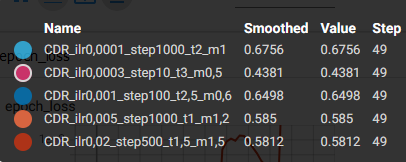
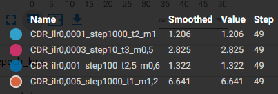
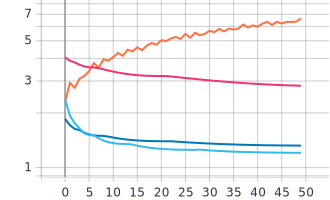
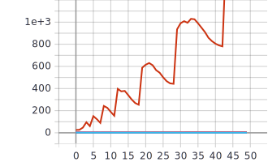
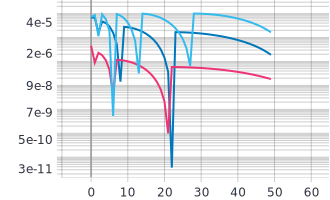
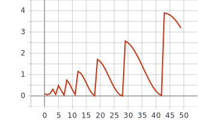
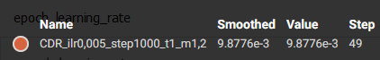

# 1) Графики обучения для нейронной сети EfficientNet-B0 с использованием Transfer Learning и различных фиксированных темпах обучения 0.01, 0.001, 0.0001
  Изменения фиксированных темпов обучения.
  
  lr - темп обучения.
```
    optimizer=tf.optimizers.Adam(lr=0.01)
```
```
    optimizer=tf.optimizers.Adam(lr=0.001)
```
```
    optimizer=tf.optimizers.Adam(lr=0.0001)
```
  - Легенда:

   
  
   График метрики качества:
   

  - Легенда:

   

  График функции потерь:
   

  # Анализ: 
  По графику метрики качества можно заметить, что наибольшая точность на валидации в 67,5% достигается при темпе обучения 0.0001, а так же получаем минимальное значение на графике потерь для валидации среди выбранных фиксированных темпах обучения. Можно выбрать темп обучения равный 0.0001 оптимальным среди предложенных темпов обучения.

# 2) Графики обучения для нейронной сети EfficientNet-B0 с использованием политики изменения темпа обучения - косинусное затухание.
  Изменения параметров косинусного затухания.
 
 initial_learning_rate - начальный темп обучения.
 
 decay_steps - количество шагов для затухания темпа.
 
 alpha - ограничение минимального темпа обучения (initial_learning_rate * alpha).
 
```
    tf.keras.experimental.CosineDecay(initial_learning_rate, decay_steps, alpha)
```

  - Легенда:

   
  
   График метрики качества на валидации:
   
   
   - Легенда:

   

  График функции потерь на валидации:
   

   - Легенда:

   

  График темпов обучения:
   
   
   График темпов представляет собой прямые линии, связано это с плохо выбранными параметрами из-за чего минимальный темп обучения достигается практически сразу же.
   
# Анализ: 
  По графику метрики качества можно заметить, что наибольшая точность на валидации для косинусного затухания с параметрами initial_learning_rate = 0.001, decay_steps = 100, alpha = 0.01 и initial_learning_rate = 0.02, decay_steps = 5000, alpha = 0 равна ≈63%, косинусное затухание с начальным темпом обучения 0.02 достигает этой точности на 1 эпохе. Однако значение функции потерь для начального темпа 0.001 меньше чем для начального темпа 0.02 на 0.949. Из данной выборки случайно взятых параметров оптимальными можно выбрать параметры (0.001, 100, 0.01).

# 3) Графики обучения для нейронной сети EfficientNet-B0 с использованием политики изменения темпа обучения - косинусное затухание с перезапусками.
  Изменения параметров косинусного затухания с перезапусками.
  
  initial_learning_rate - начальный темп обучения.
  
  first_decay_steps - начальное количество шагов для затухания темпа.
  
  t_mul - множитель темпа обучения на каждом перезапуске.
  
  m_mul - множитель количества шагов на каждом перезапуске.
  
```
    tf.keras.experimental.CosineDecayRestarts(initial_learning_rate, first_decay_steps, t_mul, m_mul)
```
   - Легенда:

   
  
   График метрики качества на валидации:
   
   

  Графики функции потерь на валидации:
   - Легенда:

   
   
   
   - Легенда:
   
   
   
   
   Графики темпов обучения:
   
   - Легенда:
   
   
   
   
   - Легенда:
   
   
   
   
   - Легенда:
   
   
   
   
   # Анализ: 
  Наилучшее значения метрики точности 67.56% на валидации достигается при параметрах initial_learning_rate = 0.0001, first_decay_steps = 1000, t_mul = 2, m_mul = 1 и достигается минимальное значение функции потерь 1.206 . Этот набор параметров является оптимальным для нашей выборки параметров.
     
# 4) Анализ полученных результатов

   Для каждого из методов выбора темпа обучения можно выбрать оптимальные параметры. Наилучшие значения точности на валидации были получены при использовании фиксированного темпа обучения и косинусного затухания с перезапусками. Хотя скорость обучения при использовании косинусного затухания с перезапусками была выше чем при использовании фиксированного темпа обучения. Для политики изменения темпа обучения косинусного затухания были выбраны не самые удачные параметры, которые не позволили достичь более высокой точности и точности других политик.
