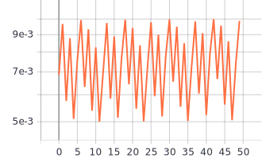

# 1) Графики обучения для нейронной сети EfficientNet-B0 с использованием Transfer Learning и различных фиксированных темпах обучения 0.01, 0.001, 0.0001
  Изменения фиксированных темпов обучения.
  
  lr - темп обучения.
```
    optimizer=tf.optimizers.Adam(lr=0.01)
```
```
    optimizer=tf.optimizers.Adam(lr=0.001)
```
```
    optimizer=tf.optimizers.Adam(lr=0.0001)
```
  - Легенда:

   
  
   График метрики качества:
   

  - Легенда:

   

  График функции потерь:
   

  # Анализ: 
  По графику метрики качества можно заметить, что наибольшая точность на валидации в 67,5% достигается при темпе обучения 0.0001, а так же минимальное значение на графике потерь для валидации среди выбранных фиксированных темпах обучения. Можно выбрать темп обучения равный 0.0001 оптимальным среди нашей выборки.

# 2) Графики обучения для нейронной сети EfficientNet-B0 с использованием политики изменения темпа обучения - косинусное затухание.
  Изменения параметров косинусного затухания.
 
 initial_learning_rate - начальный темп обучения.
 
 decay_steps - количество шагов для затухания темпа.
 
 alpha - ограничение минимального темпа обучения (initial_learning_rate * alpha).
 
```
    tf.keras.experimental.CosineDecay(initial_learning_rate, decay_steps, alpha)
```

  - Легенда:

   
  
   График метрики качества на валидации:
   
   
   - Легенда:

   

  График функции потерь на валидации:
   

   - Легенда:

   

  График темпов обучения:
   
   
   Графики представляет собой прямую линию связано это с плохо выбранными параметрами из-за чего минимальный темп обучения достигается практически сразу же.
   
# Анализ: 
  По графику метрики качества можно заметить, что наибольшая точность на валидации для косинусного затухания с параметрами (0.001, 100, 0.01) и (0.02, 5000, 0) ≈63%, косинусное затухание с начальным темпом обучения 0.02 достигает этой точности на 1 эпохе. Однако значение функции потерь для начального темпа 0.001 меньше чем для начального темпа 0.02 на 0.949. Из данной выборки случайно взятых параметров оптимальными можно выбрать параметры (0.001, 100, 0.01). ПОМЕНЯТЬ ПОМЕНЯТЬ ПОМЕНЯТЬ

# 3) Графики обучения для нейронной сети EfficientNet-B0 с использованием политики изменения темпа обучения - косинусное затухание с перезапусками.
  Изменения параметров косинусного затухания с перезапусками.
  
  initial_learning_rate - начальный темп обучения.
  
  first_decay_steps - начальное количество шагов для затухания темпа.
  
  t_mul - множитель темпа обучения на каждом перезапуске.
  
  m_mul - множитель количества шагов на каждом перезапуске.
  
```
    tf.keras.experimental.CosineDecayRestarts(initial_learning_rate, first_decay_steps, t_mul, m_mul)
```
   - Легенда:

   
  
   График метрики качества на валидации:
   
   

  Графики функции потерь на валидации:
   - Легенда:

   
   
   
   - Легенда:
   
   
   
   
   Графики темпов обучения:
   
   - Легенда:
   
   
   
   
   - Легенда:
   
   
   
   
   - Легенда:
   
   
   
   
   # Анализ: 
  По графику метрики качества можно заметить, что наибольшая точность на валидации для косинусного затухания с параметрами (0.001, 100, 0.01) и (0.02, 5000, 0) ≈63%, косинусное затухание с начальным темпом обучения 0.02 достигает этой точности на 1 эпохе. Однако значение функции потерь для начального темпа 0.001 меньше чем для начального темпа 0.02 на 0.949. Из данной выборки случайно взятых параметров оптимальными можно выбрать параметры (0.001, 100, 0.01). ПОМЕНЯТЬ ПОМЕНЯТЬ ПОМЕНЯТЬ
     
# 4) Анализ полученных результатов

   Для каждого из методов выбора темпа обучения можно выбрать оптимальные параметры, а именно для фиксированного темпа обучения максимальная точность на валидации 67,48% при темпе обучения 0.0001. В случае с косинусным затуханием стал метод с начальным темпом обучения 0.0001 на котором точность на валидации составила 67,54%, а для косинусного затухания с перезапусками 67,61% так же при начальном темпе обучения 0.0001. Можно сделать вывод, что оптимальным значением темпа обучения яв-ся 0.0001 т.к на нем были достигнуты максимальная точность и минимальная ошибка на валидации. По сравнению методов, все методы при оптимальном значении темпа обучения показали практически одинаковый результат.
